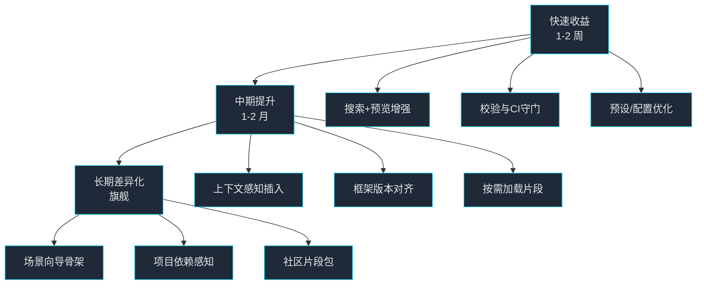

下面给出兼顾产品与技术的优化清单，按优先级分层，目标是做到 “Vue 生态里最好用的 VS Code 插件”。尽量聚焦高价值、低改动的路线，便于一两周内见效，再逐步演进。

## 快速收益（1-2 周内可落地）
- **片段体验**：为所有片段补充 `description`/`body` 中的示例与文档链接，保持 Vue/框架版本一致；对复杂片段（表单/表格/状态管理）添加可选参数（如是否含校验、分页、loading 状态）。
- **搜索与分面过滤**：在 `vue3snippets.searchSnippets` 里加入类型过滤（核心/Pinia/Router/UI 框架/测试/性能）和前缀模糊匹配；显示 snippet 预览卡片（左侧片段名 + 右侧 body 预览）。
- **配置改进**：提供“风格预设”一键切换（如 `element-plus + ts + scss + scoped`，`naive-ui + script setup + unplugin-vue-macros`）；新增 `vue3SnippetsPro.frameworkPriority`，控制默认 UI 方案。
- **质量校验**：扩展 `vue3snippets.validateSnippets`，在命令执行后汇总未通过的片段，指出缺失字段、占位符错位、重复前缀冲突；CI 加入验证脚本，避免发布坏片段。
- **文档与速查**：更新 `docs/cheatsheet.md`，对每个 UI 框架列出前缀表和小示例；在 `docs/examples.md` 增加“从 0 到可用页面”的 3-5 个典型场景（表格、表单、登录页、国际化切换、Pinia + Router 组合）。

## 中期提升（1-2 个月）
- **智能化**：在片段插入时读取当前文件上下文（是否已有 `useI18n`/`useRoute` 导入）自动补齐或去重 import；依据用户配置自动选择 `<script setup>` 或 Options API 版本。
- **生态覆盖**：补齐常用插件/工具片段：`vueuse` 热门组合（节流、防抖、监听可见性）、`unplugin-vue-components` 自动导入示例、`unplugin-auto-import` 配置示例、`vitest + @vue/test-utils` 测试片段。
- **预览增强**：在 IntelliSense 文档中添加暗色友好的示例截图或简图；对大型片段支持“展开/折叠示例”。
- **版本对齐**：在配置中记录目标框架版本（Element Plus 2.x、Naive 2.x、PrimeVue 3.x 等），根据版本切换 API/Prop（如 `n-button` 的属性差异）。
- **性能与包体**：启用按需加载片段（用户启用的框架才加载），减小激活占用；合并共享模板以减少重复。

## 长期差异化（旗舰特性）
- **场景向导**：提供命令“生成页面骨架”（如 CRUD 表格 + 筛选 + 分页 + 弹窗表单），基于配置输出一套 SFC、store、router 片段的组合。
- **项目感知**：检测项目中已安装的 UI 库/路由/i18n/Pinia，根据 `package.json` 自动设置推荐前缀和预设。
- **统计与反馈**：在本地记录最常用片段，`showStats` 里展示 Top N，并给出“建议 pin 为快捷前缀”。
- **社区扩展**：支持用户自定义片段包（扩展配置路径），并可一键校验；考虑导入 SnippetPack（JSON）并提供冲突提示。

## 技术落地建议
- **校验脚本**：在 `scripts/validate-snippets.ts` 中统一检查字段、重复前缀、占位符顺序，CI gate 阻断。
- **命令 UX**：在 `extension/src` 添加交互式 QuickPick，带标签过滤和预览；对 `searchSnippets` 返回富文档 Markdown。
- **配置预设**：在 `package.json` 的 configuration schema 增加 `presets`/`frameworkPriority`，并在命令里切换。
- **上下文感知插入**：读取当前文档 AST（可用 `@vue/compiler-sfc`/`@babel/parser`）判断是否已有 import 或是否处于 `<script setup>`，再决定插入体。

## 可视化路线图

如果要先挑三件事开干，我建议：  
1) 做片段校验 + CI 守门，避免坏体验；  
2) 改进 `searchSnippets` 的过滤与预览，立刻提升可用性；  
3) 增加配置预设与框架优先级，贴合用户习惯。